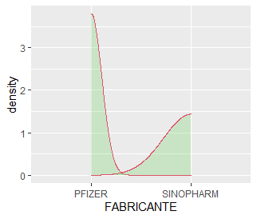

class: inverse
<UL type=square>
#INTRODUCCIÓN
En este proyecto se analizará la densidad de la población vacunada del departamento de Arequipa, para ello se optó por usar diversas librerias para poder hacer más dinamica este analisis.

#OBJETIVOS
<LI>analizar el número de personas vacunadas por PROVINCIAS

<LI>comparar por tipo de población

<LI>analizar personas no vacunadas


---
class: inverse
#PERO... ¿QUÉ ES LA DENSIDAD?
La función de densidad de probabilidad de un vector x, que se suele denotar como f ( x ) f (x) f(x) describe la probabilidad de que la variable tome un determinado valor. La función de densidad de probabilidad empírica es una versión suavizada del histograma.

## y ¿LA DENSIDAD DE KERNEL?
La Densidad kernel calcula la densidad de las entidades de punto de alrededor de cada celda ráster de salida. Conceptualmente, se ajusta una superficie curva uniforme sobre cada punto.

---
A continuación veremos un ejemplo de graficos de densidad de kernel
aplicados a la data específicamente de población vacunada por PROVINCIAS

##Lo primero que haremos será filtrar la información y con ayuda de summarise hacer un conteo por PROVINCIAS de las personas vacunadas

```{R=TRUE}

Arequipa1<- Arequipa
arequipa_vacunados<-Arequipa1 %>% group_by(PROVINCIA) %>% 
  summarise(total_vacunados= n())

#Lo siguiente que hacemos es graficar la nueva data obtenida con un gráfico de densidad

 ggplot(data=Arequipa1)+
  aes(x=PROVINCIA)+
  geom_density(color=4, fill=4, alpha= 0.25)

```
---
class: inverse
En estadística , la estimación de densidad de kernel ( KDE ) es una forma no paramétrica de estimar la función de densidad de probabilidad de una variable aleatoria . La estimación de la densidad del núcleo es un problema fundamental de suavización de datos en el que se hacen inferencias sobre la población , basadas en una muestra de datos finitos. En algunos campos, como el procesamiento de señales y la econometría , también se denomina método de ventana Parzen-Rosenblatt , después de Emanuel Parzen y Murray Rosenblatt , a quienes generalmente se les atribuye la creación independiente en su forma actual.


---
Para crear un gráfico de densidad en R, puedes pasar a la función plot un objeto creado con la función density de R, que dibujará una curva de densidad en una nueva ventana. Si lo prefieres, también puedes superponer la línea de densidad sobre un histograma con la función lines.


---
class: inverse
```{R=TRUE}
ggplot(data=Data_edit)+
   aes(x=PROVINCIA)+
   geom_density(color=4, fill=4, alpha= 0.25)
```


---
```{R=TRUE}
ggplot(data=Data_edit)+
   aes(x=SEXO)+
   geom_density(color=3, fill=4, alpha= 0.25)
```


---
class: inverse
```{R=TRUE}
ggplot(data=Data_edit)+
   aes(x=FABRICANTE)+
   geom_density(color=2, fill=3, alpha= 0.25)
```



---
```{R=TRUE}
ggplot(data=Data_edit)+
   aes(x=DISTRITO)+
   geom_density(color=3, fill=2, alpha= 0.25)
```


---
class: inverse
##A continuación veremos un ejemplo de densidad, según la cantidad de personas vacunadas
```{R=TRUE}
#Librerias a usar
library(tmap)     
library(extrafont)
library(leaflet)

#Carga de datos
Vac_dAreq <- st_read("Dep_Arequipa_vac.shp")
Vac_dAreq
tm_shape(Vac_dAreq) + tm_polygons()

tmap_mode("view")
tm1 <- tm_shape(Vac_dAreq) + 
    tm_polygons(col = "Field16",
                style = "quantile")

tm0 <- tm_shape(Vac_dAreq) +
    tmap_options(inner.margins = c(0.1,0.1, 0.02,0.01)) +
    tm_fill("Field16",
            title = "Cantidad de Vacunados",
            palette = "viridis",
            style = "quantile") + 
    tm_text('NOMBDIST',
            size = 0.5,
            fontface = 2,
            fontfamily = 'Tw Cen MT Condensed')
   

tm2 <- tm_shape(Vac_dAreq) + tm_bubbles(size = "Field16", legend.max.symbol.size = "Field16", 
                                        col = "red") +
    tm_borders(col = "blue") + tm_text('NOMBDIST',
                           size = 0.6,
                           fontface = 2,
                           fontfamily = 'Tw Cen MT Condensed') +
    tm_layout(title = "Departamento de Arequipa") +
    tm_add_legend(title = "Densidad", labels =Vac_dAreq$Field16, col="red")

tmap_arrange(tm0, tm2)


```
---


---
class: inverse


---
A continuación veremos un análisis global de los casos confirmados en sudamerica del covid hasta la fecha: 08/ AGOSTO/2021
##Usar scripts y datos de R
```{R=V}
library(covid19.analytics)
library(rnaturalearth)
library(rnaturalearthdata)
library(sf)
library(hrbrthemes)
library(tidyverse)
library(gganimate)

Paises_SA <- c("Argentina","Bolivia","Brasil","Colombia","Peru")
dCOVID <- covid19.data("ts-confirmed")
dCOVID <- covid19.data("ts-confirmed")%>%
    filter(Country.Region %in% Paises_SA)
dCOVID

dCOVID%>%view()

dCOVID <- dCOVID%>%
    rename(Country = Country.Region)
head(dCOVID)

dCOVID_SA <- dCOVID%>%
    select(-c(1,3,4))%>%group_by(Country)%>%
    summarise(across(.fns = sum))%>%
    pivot_longer(-1)%>%group_by(Country)%>%
    summarise(fecha=last(name),Confirmados=last(value))

dCOVID_SA <- dCOVID_SA%>%
    left_join(dCOVID%>%
                  select(Country,
                         Lat,Long)%>%
                  group_by(Country)%>%
                  summarise(Lat=last(Lat),
                            Long=last(Long)))


cAmerica <- ne_countries(continent = "South America", scale = "medium", returnclass='sf')%>%
    filter(admin%in%Paises_SA)

dCOVID_SA_americamap <- left_join(cAmerica,
                                dCOVID_SA,
                                by=c("admin"="Country"))%>%
    mutate(ratio=round(100*Confirmados/pop_est,2))

dCOVID_SA_americamap%>%
    ggplot() +
    geom_sf(aes(fill=ratio),alpha=6)+
    scale_fill_gradient(low="blue", high = "red")+
    coord_sf(xlim = c(-100,-20), ylim = c(-60,35), expand = T) + 
    geom_label_repel(data=dCOVID_SA_americamap,
                     aes(Long, Lat, label = ratio),
                     fill = "grey50")+
    theme(panel.grid.major = element_line(color = gray(0.5), linetype = "dashed",
                                          size = 0.5),
          panel.background = element_rect(fill = "aliceblue"),
          axis.title.y = element_blank(),
          axis.title.x = element_blank(),
          legend.title = element_blank(),
          plot.background = element_rect(fill = "moccasin"))+
    xlab(NULL) + 
    ylab(NULL)+
    labs(title = "Porcentaje Poblacion Infectada")

Grafico <- dCOVID%>%
    select(-c(1,3,4)) %>%
    group_by(Country) %>%
    summarise(across(.fns = sum)) %>%
    pivot_longer(-1) %>% left_join(cAmerica %>% group_by(admin) %>% summarise(pop_est=last(pop_est)),by=c("Country"="admin"))%>%
    ggplot(aes(as.Date(name),10^5*value/pop_est,group = Country, col=Country))+
    geom_line()+
    xlab(NULL) + 
    ylab(NULL)+
    theme_bw()+
    facet_wrap(~Country)+
    theme_ft_rc()+
    labs(title = "Casos Confirmados Acumulados Covid19",
         caption = "Fuente: Elaboracion propia a partir del paquete covid19.analytics")+
    theme(legend.position = "none",
          axis.text.y = element_text(size=9.5))
Grafico

Grafico + 
    transition_reveal(as.Date(name))+
    labs(subtitle = "Por cada 100 0000 Hab")
```
---

class: inverse
##CÓDIGO DE SHINY
```{R=V}
ui <- fluidPage(
  shinythemes::themeSelector(),
  sidebarPanel(

  ),
  mainPanel(
    tabsetPanel(
      tabPanel("PROYECTO FINAL")
    )
  ),
  titlePanel("ANÁLISIS MULTIVARIADO DEL COVID EN AREQUIPA)"), style="color:green",
  sidebarLayout(
    sidebarPanel(
      fileInput("file1", "Ingresar CSV Aqui",
                multiple = FALSE,
                accept = c("text/csv","text/comma-separated-values,text/plain",".csv")
      ),
      tags$hr(),
      h5(helpText("Seleccione los parametros:")),
      checkboxInput(inputId = 'header', 'Header', T),
      checkboxInput(inputId = "stringAsFactors", "stringAsFactors", T),
      br(),
      radioButtons("sep", "Separador",
                   choices = c(Coma = ",",
                               puntoyComa = ";",
                               Tab = "\t",
                               espacio=''),
                   selected = ","),
      radioButtons("quote", "Cita",
                   choices = c(Ninguna = "",
                               "cita doble" = '"',
                               "cita simple" = "'"),
                   selected = '"'),
      
      
    
        
      
      #radioButtons("disp", "Display",choices = c(Head = "head",All = "all"),selected = "head")
    ),
    
    
    mainPanel(uiOutput("todo"))
  )
)

server <- function(input,output){
  data <- reactive({
    file <- input$file1
    if(is.null(file)){return()} 
    read.table(file=file$datapath,
               sep=input$sep,
               header = input$header,
               stringsAsFactors = input$stringAsFactors)
  })
  output$filedf <- renderTable({
    if(is.null(data())){return ()}
    input$file1
  })
  output$sum <- renderTable({
    if(is.null(data())){return ()}
    summary(data())
  })
  output$table <- renderTable({
    if(is.null(data())){return ()}
    data()
  })
  
  
  
 
   #if(is.null(data())){return ()}
  
  #
  
  output$map<- renderLeaflet({
    df <- read.csv(input$file1$datapath,
                   header = input$header,
                   sep = input$sep,
                   quote = input$quote)
    mapa<-leaflet(zona_estudio1) %>%addProviderTiles("Stamen.TonerLite",group = "Toner") %>%
      addProviderTiles("HikeBike", group = "Bike") %>% 
      addProviderTiles("Esri", group = "Esri") %>%
      addProviderTiles("Stamen.Watercolor", group="Acuarela") %>%
      addLayersControl(overlayGroups = c("capapuntos"),baseGroups = c("Toner", "Bike", "Esri","Acuarela")) %>%addPolygons()%>% 
      addTiles()
  })
  
  
  output$provincia <- renderPrint({ input$data })
  output$provincia<- renderPlot({
    df<- read.csv(input$file1$datapath,
                    header = input$header,
                    sep = input$sep,
                    quote = input$quote)
    ggplot(data=Data_edit)+
      aes(x=PROVINCIA)+
      geom_density(color=4, fill=4, alpha= 0.25)
  })
  
  output$fabricante <- renderPrint({ input$data })
  output$fabricante<- renderPlot({
    df<- read.csv(input$file1$datapath,
                  header = input$header,
                  sep = input$sep,
                  quote = input$quote)
    ggplot(data=Data_edit)+
      aes(x=FABRICANTE)+
      geom_density(color=2, fill=3, alpha= 0.25)
  })
    
  output$distrito <- renderPrint({ input$data })
  output$distrito<- renderPlot({
    df<- read.csv(input$file1$datapath,
                  header = input$header,
                  sep = input$sep,
                  quote = input$quote)
    ggplot(data=Data_edit)+
      aes(x=DISTRITO)+
      geom_density(color=3, fill=2, alpha= 0.25)
    
  })
  
  output$sexo <- renderPrint({ input$data })
  output$sexo<- renderPlot({
    df<- read.csv(input$file1$datapath,
                  header = input$header,
                  sep = input$sep,
                  quote = input$quote)
    ggplot(data=Data_edit)+
      aes(x=SEXO)+
      geom_density(color=3, fill=4, alpha= 0.25)
    
  })
  output$todo <- renderUI({
    if(is.null(data()))
      h5("desarrollado con", tags$img(src='RStudio-Ball.png', heigth=200, width=200))
    else
      tabsetPanel(tabPanel("inicio", tableOutput("filedf")),
                  tabPanel("Datos", tableOutput("table")),
                  tabPanel("resumen", tableOutput("sum")),
                  tabPanel("mapita con leaflet", leafletOutput("map")),
                  tabPanel("dens provincias", plotOutput("provincia")),
                  tabPanel("dens fabricante", plotOutput("fabricante")),
                  tabPanel("dens distrito", plotOutput("distrito")),
                  tabPanel("dens sexo", plotOutput("sexo"))
      )
  })
  
}


# Run the application 
shinyApp(ui = ui, server = server)
```